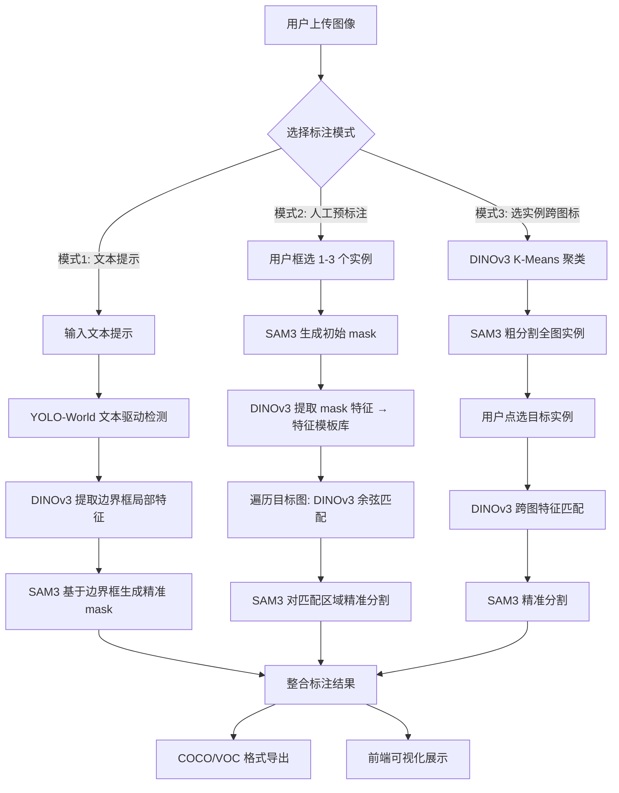

# Auto-label：人机协同图像自动标注工具

基于 **SAM3 + YOLO-World + DINOv3** 三大预训练模型的多模式人机协同标注系统。

## 项目架构

```
Auto-label/
├── backend/                    # Python 后端
│   ├── main.py                 # FastAPI 主入口
│   ├── config.py               # 全局配置
│   ├── api/                    # API 路由层
│   │   ├── files.py            # 文件上传/管理
│   │   ├── annotate.py         # 三种标注模式触发
│   │   └── export.py           # 结果导出
│   ├── core/                   # 算法核心层
│   │   ├── pipeline.py         # 标注流水线编排器
│   │   ├── yoloworld_detector.py  # YOLO-World 检测器
│   │   ├── dino_extractor.py   # DINOv3 特征提取器
│   │   └── sam3_segmentor.py   # SAM3 分割器
│   ├── services/               # 业务服务层
│   │   └── annotation_service.py  # 标注业务逻辑
│   └── utils/                  # 工具函数
│       └── format_converter.py # COCO/VOC 格式转换
├── frontend/                   # React 前端
│   ├── src/
│   │   ├── App.tsx             # 主页面
│   │   ├── api/index.ts        # API 接口封装
│   │   └── components/         # 核心组件
│   │       ├── Mode1Panel.tsx  # 文本提示标注
│   │       ├── Mode2Panel.tsx  # 人工预标注
│   │       ├── Mode3Panel.tsx  # 选实例跨图标
│   │       └── AnnotationViewer.tsx  # 标注可视化
├── Dockerfile                  # Docker 构建
├── docker-compose.yml          # Docker Compose
└── README.md
```

## 数据流转流程



## 核心算法模块

| 模块 | 模型 | 作用 | 输入 | 输出 |
|------|------|------|------|------|
| 检测器 | YOLO-World-v2-S | 文本驱动开放词汇检测 | 图像 + 文本提示 | 边界框 + 类别 + 置信度 |
| 特征提取器 | DINOv3 ViT-S/16 | 自监督视觉特征提取 | 图像/区域 | 384维特征向量 |
| 分割器 | SAM3 | 精准实例分割 | 图像 + 提示(框/文本) | 实例 mask |

## API 接口

| 接口 | 方法 | 说明 |
|------|------|------|
| `/api/files/upload` | POST | 上传图像 |
| `/api/files/list` | GET | 获取图像列表 |
| `/api/annotate/mode1` | POST | 模式1：文本提示标注 |
| `/api/annotate/mode2` | POST | 模式2：人工预标注批量标注 |
| `/api/annotate/mode3/cluster` | POST | 模式3第一步：聚类 |
| `/api/annotate/mode3/annotate` | POST | 模式3第二步：跨图标注 |
| `/api/annotate/update_params` | POST | 动态更新参数 |
| `/api/export/list` | GET | 列出导出结果 |
| `/api/export/download/{name}` | GET | 下载标注文件 |
| `/api/export/download_all` | GET | 打包下载全部 |

## 本地部署

### 环境要求
- Python >= 3.11
- CUDA >= 12.1
- GPU 显存 >= 12GB (RTX 3060/3090)
- Node.js >= 18

### 步骤

```bash
# 1. 安装 PyTorch
pip install torch torchvision --index-url https://download.pytorch.org/whl/cu121

# 2. 安装 MMCV (YOLO-World 依赖)
pip install openmim
mim install mmcv==2.0.0

# 3. 安装后端依赖
cd Auto-label
pip install -r backend/requirements.txt

# 4. 安装算法库
cd ../dinov3 && pip install -e .
cd ../sam3 && pip install -e .
cd ../YOLO-World && pip install -e .

# 5. 启动后端
cd ../Auto-label
python -m backend.main

# 6. 安装前端依赖并启动
cd frontend
npm install
npm run dev
```

### Docker 部署

```bash
cd Auto-label
docker-compose up --build
```

## 效果验证方案

### 测试数据集
- COCO2017 验证集细分类子集（选取 person, car, dog, cat 等常见类别）

### 量化指标
| 指标 | 说明 | 目标 |
|------|------|------|
| mask mIoU | 分割精度（与 GT 的交并比） | ≥ 0.75 |
| 标注效率 | 每张图平均标注时间 | ≤ 5s/张 |
| 跨图匹配准确率 | 模式2/3 的匹配正确率 | ≥ 0.85 |

### 对比实验
| 方案 | 检测 | 特征增强 | 分割 |
|------|------|----------|------|
| 基线A | YOLO-World | 无 | SAM3 |
| 基线B | 无 | DINOv3 | SAM3 |
| 本方案 | YOLO-World | DINOv3 融合 | SAM3 |

验证 DINOv3 特征融合对小目标/细粒度类别的 mIoU 提升效果。

## 关键技术创新点

1. **DINOv3 特征融合增强**：将 DINOv3 的自监督局部 patch 特征与 YOLO-World 检测结果结合，提升细粒度类别（如条纹猫、斑点狗）的语义区分能力
2. **三模式人机协同**：文本驱动纯自动 + 少量人工预标注批量扩展 + 聚类选实例跨图标注，覆盖不同标注场景
3. **特征模板匹配**：基于 DINOv3 384维特征的余弦相似度匹配，支持动态阈值调整，实现"标一个、标一批"
4. **显存优化**：全部使用轻量模型（ViT-S/16 + YOLO-World-S），单批次 ≤5 张图，适配 12GB 消费级 GPU

## 参数配置

所有参数可通过 `backend/config.py` 或 API `/api/annotate/update_params` 动态调整：

| 参数 | 默认值 | 说明 |
|------|--------|------|
| `similarity_threshold` | 0.8 | 特征匹配阈值（模式2/3） |
| `kmeans_clusters` | 10 | K-Means 聚类数（模式3） |
| `score_thr` | 0.3 | YOLO-World 检测置信度阈值 |
| `max_batch_size` | 5 | 单批次最大处理图像数 |
| `export_format` | coco | 导出格式 (coco/voc) |
